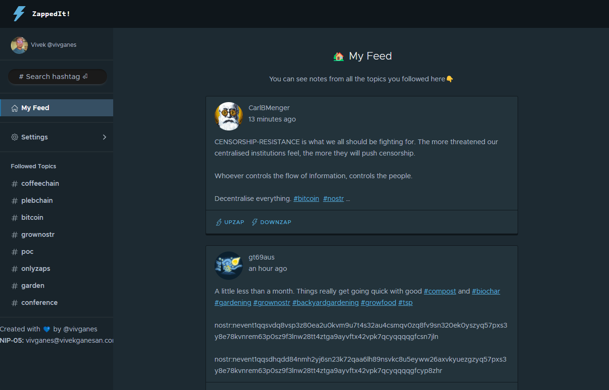

# Zappedit

A reddit-style nostr client

 * [Reddit Vs. Zappedit](#reddit-vs-zappedit)
 * [Screenshot](#screenshot)

## Reddit Vs. Zappedit

**Reddit** | **ZappedIt**
---------- | ------------
Users search for sub-reddits like r/nostr, r/tifu, etc. and follow them. | Users search for hashtags like #coffeechain, #foodstr, etc. and follow them.
Home feed is filled with posts from their subscribed sub-reddits. |User's feed is filled with recent notes mentioning the followed hashtags, in the reverse-chronological order.
Users express appreciation through upvotes. | Users express appreciation through Upzaps. Sats in the Upzaps are sent to the **author of the upzapped note**.
Users express disagreement through downvotes | Users express disagreement through Downzaps.  Sats in the Downzaps are sent to the **Downzap recipient**, who is a nostr user chosen by the down-zapper
Users see a tally of upvotes vs downvotes for each post | Users see a tally of upzap sats and downzap sats for each note

## Screenshot

## Features Checklist
  - [x] NIP-07 login
  - [x] Search hashtag
  - [x] Follow, Unfollow hashtag
  - [x] Feed with notes
  - [x] Hashtags linking
  - [x] Image display in note
  - [x] Set a downzap recipient
  - [x] Upzaps and Downzaps using QR Code
  - [ ] Show user mentions in notes
  - [ ] Configure multiple downzap recipients - Exact recipient randomly chosen during the downzap
  - [ ] Load images only for notes by 'followed' users
  - [ ] Relay list
  - [ ] Switch light mode/dark mode

